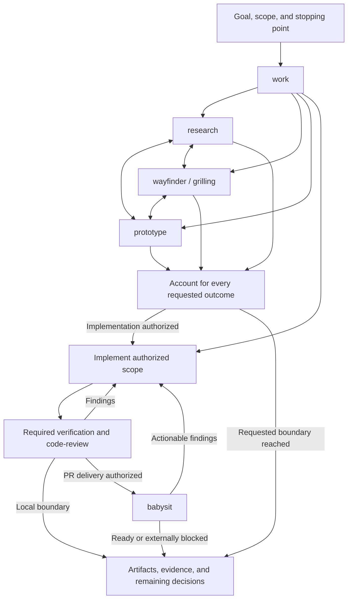

# Ignyte workflow mockup

This is a local, reviewable skill implementation. It adds no workflow engine,
service, database, or new runtime dependency. Onboarding points to `ignyte:work`;
the agent selects specialist skills from the user's outcomes and current evidence.

## How it works

The graph is a description of agent decisions, not an executable state machine.
Branches can combine or repeat. Explicit ordering controls sequencing. Independent
work may run together when appropriate. A plan-only request stops at the plan;
publishing, merging, and deployment depend on the task's existing authorization.
Actual host Plan mode and permissions are not changed by this skill.

## Changes

- Added `work` as the entry point and promoted `babysit` from Hounddog.
- Rewrote every specialist around its purpose, decisions, and completion evidence.
- Folded `implement` into the entry point and `grill-with-docs` into planning.
- Replaced `setup-matt-pocock-skills` with `project-setup`, preserving discovery of
  existing tracker, label, and domain configuration.
- Removed redundant examples, fixed UI recipes, author-specific setup templates,
  and the shell reproduction template. Retained their useful constraints in the
  relevant skills.
- Kept all 18 skills agent-invocable. Claude Code's direct user invocation is
  disabled. Codex still permits explicit selection; no equivalent restriction is
  claimed.
- Updated the author inventory and retained both upstream MIT license notices.

Compared with the pre-change skills repository, skill Markdown decreased from
24,109 whitespace-separated words to about 3,700, including supporting documents.
This is roughly an 85 percent reduction in stored instructions, not a measurement
of startup context or model tokens. Specialist descriptions remain discoverable.
The complete inventory links to each skill's exact text in [the README](../README.md).

## Validation

Validated on the installed Codex 0.156.0 and Claude Code 2.1.280.

| Check | Result and boundary |
|---|---|
| YAML and invocation metadata | All 18 frontmatters and Codex policy files parse; each permits agent invocation and sets Claude's user-invocable flag to false. |
| Skill-creator core validation | All 18 pass. The supplied validator lacks the documented Claude flag, so that flag was checked separately and omitted only from temporary validation copies. |
| Links and instruction audit | All specialist links resolve. Independent review found no blocking instruction conflicts or lost capability requiring a removed template. |
| Installed Codex loader | All 18 load as enabled in an isolated workspace with no loader errors. This tests discovery/loading, not autonomous selection accuracy. |
| Claude manifests | Plugin and marketplace validate. The warning about an absent version is expected: the existing package intentionally follows commits. This is manifest validation, not a live Claude workflow run. |
| Onboarding suite | 97 of 99 checks pass. The two unchanged failures concern retired-key assumptions for web_search, which the baseline now sets explicitly. Both had already been reproduced against unchanged HEAD. |

The core validator and loader ran from disposable directories. No live plugin
installation or developer configuration was changed. Documentation and metadata
were formatted with the repository's UTF-8/CRLF policy and checked for whitespace,
schema, and link errors. No permanent test suite was added.

### Independent routing simulation

An independent agent read the actual skill files and described its actions and
stopping points for these requests. These are instruction-following simulations,
not ten live implementation runs.

| Request | Observed interpretation |
|---|---|
| Research and prototype an offline task board | Produce both sourced findings and a disposable demo; no production code. |
| Plan, prototype the riskiest part, update the plan | Preserve the requested order and return the revised plan. |
| Prototype settings and plan the selected design before selection exists | Complete independent work; leave design-dependent planning blocked on selection. |
| Fix, validate, commit; do not push | Stop at a local commit. |
| Check PR status | Inspect once and report; no fixes or sustained monitoring. |
| Implement, publish, and babysit; leave open | Follow reviews and checks to readiness without merging. |
| Merge after checks and reviews pass | Honor existing conditional merge authorization and recheck gates. |
| Status question, then an explicit pause during delivery | Status does not cancel the task; a pause stops ongoing work. |
| Review staged, unstaged, and untracked changes | Include all requested scopes and stay read-only. |
| Small fix without authorization for new tests | Run existing checks without inventing new test scope. |

The evaluation exposed a needless full-diff requirement for simple PR status
checks; the final babysit text narrows full-diff inspection to delivery or findings
that require it. It also distinguishes blocking results from optional bot comments.

### Forward execution

A separate agent received a task-board brief and the request to prototype first,
then produce a plan based on the prototype. It used work, prototype, wayfinder,
and unslop, and produced a disposable HTML board, a plan, and an execution record
outside the repositories.

The actual board script ran in Node with a minimal DOM stand-in. Nine checks
covered initial columns, available actions, valid moves, blocked transitions, and
repeated reset. The plan distinguished those observations from unverified browser
rendering, accessibility, focus behavior, and open product choices. The agent
stopped before production changes, commits, or publication.

This demonstrates one combined workflow. It is not evidence of identical outcomes
across models, repeated trials, or every future request. Automatic route selection
and real PR delivery still need a rollout pilot on both CLIs.

## Rollout boundary

These local commits are for review. The installed caches and other developers'
machines still use the published package. Publish the shared skills before the
onboarding pointer, then refresh clients. Hounddog's original local skill remains
available until that rollout; its removal belongs to the follow-up migration.

Background research is preserved in [the session audit](session-workflow-audit.md)
and [PStack review](pstack-routing-research.md). Those are historical design
evidence, not additional runtime instructions or the current inventory.
